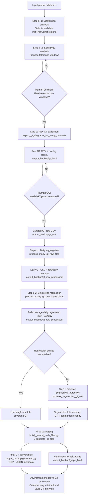

# Ground Truth (GT) Workflow Documentation

This document describes the current GT pipeline under `master_arbeit_Di/ground_truth`,
following the `a_1 -> a_2 -> b -> c -> d (optional) -> final packaging` convention.
It is intended to make the full data and decision flow explicit, including
human-in-the-loop quality control.

## 1. End-to-End Workflow

### Step a_1: Reference-condition distribution analysis

- Notebook: `a_1_dataset_distribution.ipynb`
- Module: `a_1_data_distribution.py`
- Entry function: `analyze_reference_condition_distribution()`
- Main output directory: `master_arbeit_Di/ground_truth/output_backup/output_histrogram/`
- Purpose: identify dense candidate regions in `(Iref, Tref, OHref)` space.

Human checkpoint:

- Review hotspot tables and 1D/3D distributions.
- Select candidate reference anchors and initial tolerance windows.

### Step a_2: Sensitivity-based tolerance estimation

- Notebook: `a_2_find_gt_tolerance_ranges.ipynb`
- Canonical module: `a_2_find_gt_tolerance_ranges.py`
- Main entry: `run_range_estimation()`
- Output: console report with sensitivities, selected interval counts, and suggested windows.

Human checkpoint:

- Use suggested windows as guidance.
- Finalize engineering tolerance ranges for extraction.

### Step b: Raw GT extraction and diagnostic overlays

- Notebook: `b_dataset_gt_distribution.ipynb`
- Module: `b_gt_distribution.py`
- Entry: `export_gt_diagrams_for_many_datasets()`
- Main output directory: `master_arbeit_Di/ground_truth/output_backup/gt_html/`
- Typical artifacts: raw GT CSV files and interactive HTML overlays.

Human checkpoint:

- Inspect overlays and remove invalid GT points when necessary.
- Save manually curated CSV files to `master_arbeit_Di/ground_truth/output_backup/gt_raw/`.

### Step c: Daily aggregation and single-line regression

- Notebook: `c_dataset_gt_raw_process.ipynb`
- Module: `c_gt_raw_process.py`
- Main entries:
  - `process_many_gt_raw_files()`
  - `process_many_gt_raw_regressions()`
- Output directory: `master_arbeit_Di/ground_truth/output_backup/gt_raw_processed/`

Implementation note:

- For days with multiple raw GT points, the current implementation aggregates to one
  value per day using the **daily mean**.

Human checkpoint:

- Validate daily overlays and regression quality.
- If single-line regression is not adequate, continue to segmented regression.

### Step d (optional): Segmented regression for special cases

Use this step when a specific time interval shows an obviously abnormal degradation
rate compared with the periods before and after it (for example, a suspicious block
in `G1M1` high-load GT). In this case, the unreliable interval is manually removed
from the CSV and treated as a no-GT region. During model-vs-GT evaluation, only the
retained GT intervals are compared.

- Notebook: `d_g1m1_high_load_segmented_regression.ipynb`
- Module: `d_gt_raw_segmented.py`
- Entry: `process_segmented_gt_raw()`
- Input: daily-mean CSV from `output_backup/gt_raw_processed/`
- Typical artifacts:
  - `*__segmented_regression_full_coverage.csv`
  - `*__segmented_regression.html`

### Final packaging: Build GT deliverables

- Script: `build_ground_truth_files.py`
- Main entry: `generate_gt_files()` (called by `main()`)
- Output directories:
  - `master_arbeit_Di/ground_truth/output_backup/generated_gt/`
  - `master_arbeit_Di/ground_truth/output_backup/graph_html/`
- Purpose: generate final GT CSV/JSON metadata and HTML verification plots per Iref.

## 2. Stage-to-Artifact Mapping

- `a_1`: Distribution analysis artifacts for reference-condition candidate discovery.
- `a_2`: Sensitivity reports and suggested tolerance windows.
- `b`: Raw GT extraction CSV + diagnostic overlays (before/after manual cleaning).
- `c`: Daily aggregated GT, single-line regression outputs, full-coverage daily GT series.
- `d` (optional): Segmented regression outputs for cases where one-line regression is not valid.
- Final packaging: final deliverables consumed by downstream modeling and evaluation.

## 3. Detailed Flowchart: Final GT Generation Logic

